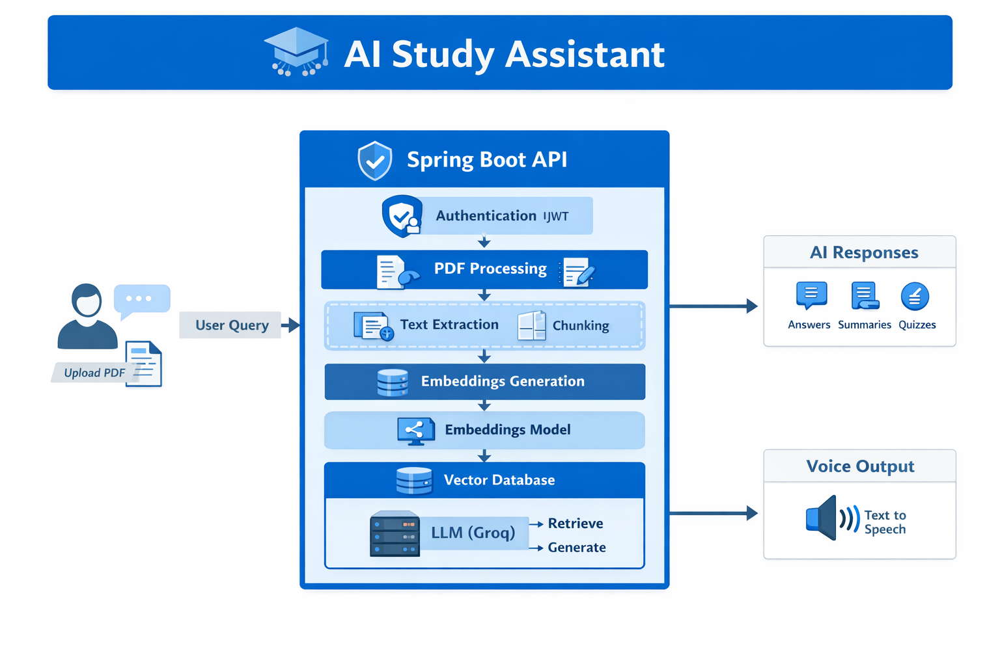
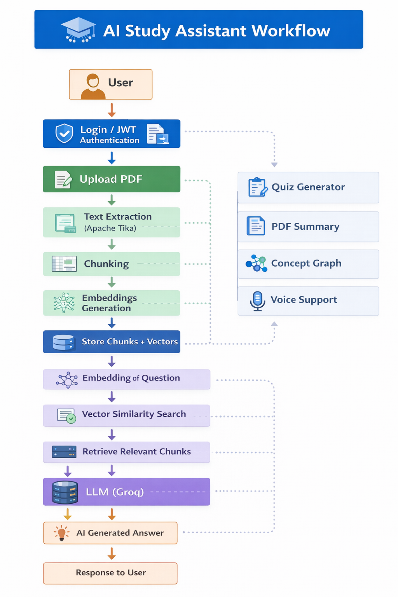
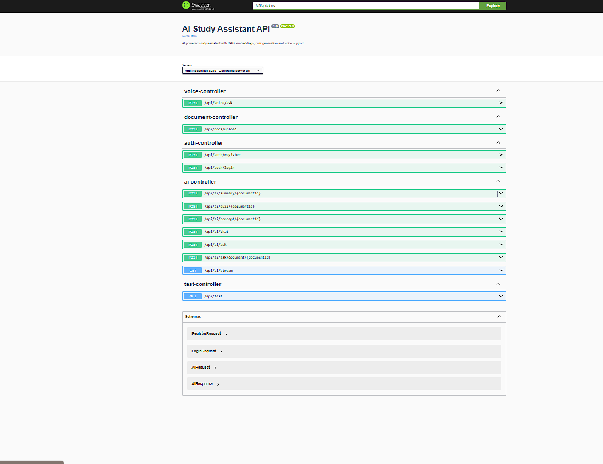

# AI Study Assistant 🚀

An AI-powered backend system built with **Spring Boot + Spring AI** that allows users to upload study material (PDFs) and interact with them using natural language.

The system uses **RAG (Retrieval Augmented Generation)** with embeddings and vector similarity search to generate accurate answers from documents.

---

# Features

• User Authentication using JWT  
• Upload and process PDF study material  
• Extract text using Apache Tika  
• Intelligent document chunking  
• Vector embeddings for semantic search  
• RAG-based AI question answering  
• Conversation memory for contextual chat  
• Automatic PDF summarization  
• AI-generated quizzes from study material  
• Concept visualization (graph format)  
• Streaming AI responses (ChatGPT-style)  
• Voice query support  
• Swagger API documentation

---

# Tech Stack

Backend:
- Java 17
- Spring Boot
- Spring Security
- Spring AI

AI / LLM:
- Groq API
- Llama 3.3 70B

Data Processing:
- Apache Tika

Database:
- MySQL

Documentation:
- Swagger (OpenAPI)

---

# System Architecture

```
User
  │
  ▼
Spring Boot API
  │
  ├── Authentication (JWT)
  │
  ├── Document Processing
  │     ├── PDF Upload
  │     ├── Text Extraction
  │     └── Chunking
  │
  ├── Embeddings Generation
  │
  ├── Vector Similarity Search
  │
  └── LLM (Groq / Llama 3.3)
        │
        ▼
   AI Generated Answers
```

---

# API Documentation

Swagger UI:

```
http://localhost:8080/swagger-ui/index.html
```

---

# Installation

Clone the repository

```
git clone https://github.com/yourusername/ai-study-assistant.git
```

Navigate to project

```
cd ai-study-assistant
```

Run the application

```
mvn spring-boot:run
```

---

# Environment Variables

Add your Groq API key in `application.properties`

```
spring.ai.openai.api-key=YOUR_API_KEY
spring.ai.openai.base-url=https://api.groq.com/openai/v1
```

---

# Example Workflow

1️⃣ Register/Login  
2️⃣ Upload PDF study material  
3️⃣ Ask questions about the document  
4️⃣ Generate summaries and quizzes  
5️⃣ Visualize concepts

---

# Future Improvements

• React frontend dashboard  
• Graph visualization using React Flow  
• Semantic search across multiple documents  
• Study progress analytics

---

## System Architecture

The following diagram illustrates the overall architecture of the **AI Study Assistant** system, including authentication, document processing, embeddings generation, vector search, and LLM integration.



---

## System Workflow

The workflow below shows how a user interacts with the system — from uploading a PDF to retrieving AI-generated answers using RAG (Retrieval Augmented Generation).



---

## API Documentation (Swagger)

The project includes interactive API documentation using **Swagger (OpenAPI)**.  
This allows developers to test all endpoints directly from the browser.

Swagger UI is available at :
http://localhost:8080/swagger-ui/index.html



---

### Example Endpoints

| Method | Endpoint | Description |
|------|------|------|
POST | /api/auth/login | User authentication |
POST | /api/document/upload | Upload PDF |
POST | /api/ai/ask | Ask question from document |
POST | /api/ai/summary | Generate document summary |
POST | /api/ai/quiz | Generate quiz from document |
POST | /api/voice/ask | Voice-based question |
GET | /api/ai/stream | Streaming AI response |

---

# Author

Yashpal Parmar  
Computer Science Engineering Student  


